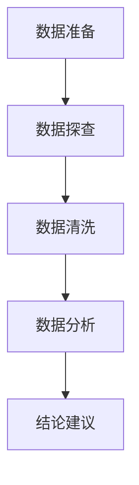

personal-expense-analysis
## 📋 目录
- [项目核心](#-项目核心)
- [关键结论](#-关键结论)
- [核心可视化](#-核心可视化)
- [行动建议](#-行动建议)
- [分析流程](#-分析流程.)

## 🎯 项目核心
- **目标**：分析个人近一年消费数据，定位优化空间
- **数据规模**：3128条原始记录 → 2855条有效支出数据
- **核心价值**：识别16%月度支出优化空间，建立理性消费模型
## 📊 关键结论
1.  **消费结构**：出行（36.1%）、转账（20.5%）、旅行（15.4%）为主要支出项
2.  **时间规律**：2月/9月支出最高，周三/周五消费集中（聚餐/旅游驱动）
3.  **优化重点**：聚餐AA频次、旅游出行方式、无规划消费场景

## 📊 核心可视化

## 💡 行动建议
- 设定每月聚餐预算上限
- 建立周三/周五消费预警机制
- 旅游优先选择火车以降低交通成本

## 分析流程

## 依赖安装
pip install pandas matplotlib

## 快速运行
python src/Python源代码.py
### 📝 补充说明
完整分析报告、代码及可视化图表详见pdf文件，本文件仅展示核心结论。
